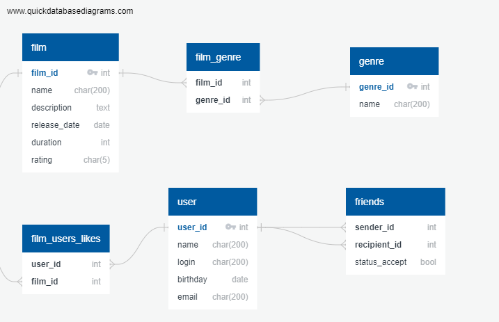

# java-filmorate

### ER-диаграмма БД:

##### Примеры запросов:

Получить фильм по [id]:
~~~
SELECT *
FROM film
WHERE film_id = [id];
~~~
Получить список [friend_id] друзей пользователя по [id]
~~~
SELECT recipient_id
FROM friends
WHERE sender_id = [id]
~~~
Получить список [genre_id] фильма по [film_id]
~~~
SELECT genre_id
FROM film_genre
WHERE film_id = [film_id]
~~~