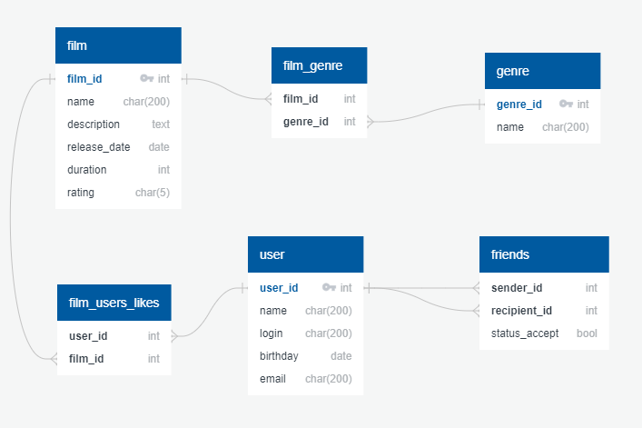

# java-filmorate

#### Диаграмма БД приложения:

##### Примеры запросов:
###### Получить фильм по [id]:
~~~
SELECT * 
FROM film
WHERE film_id = [id];
~~~
###### Получить топ популярных фильмов:
~~~
SELECT f.film_id,
       f.name,
       f.description,
       f.release_date,
       f.duration,
       f.rating
FROM film AS f
JOIN
  (SELECT film_id,
          COUNT(*) AS count_likes
   FROM film_users_likes
   GROUP BY film_id) AS l ON f.film_id = l.film_id
ORDER BY l.count_likes DESC
LIMIT [count];
~~~
###### Получить список друзей пользователя по его [id]:
~~~
SELECT user_id,
       name,
       login,
       birthday,
       email
FROM USER
WHERE user_id IN
    (SELECT recipient_id
     FROM friends
     WHERE sender_id = [id]
     UNION SELECT sender_id
     FROM friends
     WHERE recipient_id = [id]);
~~~
###### Получить список общих друзей по их [id] и [otherId]:
~~~

~~~
