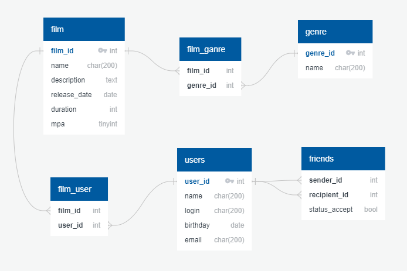

# java-filmorate

### ER-диаграмма БД:

##### Примеры запросов:

Получить фильм по [id]:
~~~
SELECT *
FROM film
WHERE film_id = [id];
~~~

Получить топ [count] фильмов:

~~~
SELECT f.film_id,
       f.name,
       f.description,
       f.release_date,
       f.duration,
       f.rating
FROM film AS f
JOIN
  (SELECT film_id,
          count(*) AS COUNT
   FROM film_user
   GROUP BY film_id
   ORDER BY count(*) DESC
   LIMIT [count]) AS fu ON f.film_id = fu.film_id
ORDER BY fu.count DESC;
~~~
Получить список друзей пользователя по [id]
~~~
SELECT (*)
FROM user
WHERE user_id IN
    (SELECT recipient_id AS id
     FROM friends
     WHERE sender_id = [id]
     UNION 
     SELECT sender_id AS id
     FROM friends
     WHERE recipient_id = [id])
~~~
Получить список общих друзей пользователей по [id] и [other_id]
~~~
SELECT *
FROM USER
WHERE user_id IN
    (SELECT *
     FROM
       (SELECT recipient_id AS id
        FROM friends
        WHERE sender_id = [id]
        UNION SELECT sender_id AS id
        FROM friends
        WHERE recipient_id = [id])
     WHERE id IN
         (SELECT recipient_id AS id
          FROM friends
          WHERE sender_id = [other_id]
          UNION SELECT sender_id AS id
          FROM friends
          WHERE recipient_id = [other_id]));
~~~